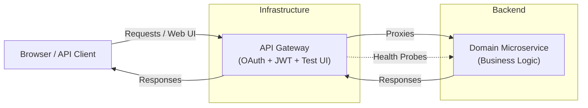

# MPDev API Gateway

This repository hosts the shared gateway that fronts my backend microservices. It terminates OAuth (Google) login, mints JWTs, enforces route-level authorization, injects user identity headers, proxies traffic, and offers a built-in Test UI/health dashboard for local exploration.

## Architecture

| Layer | Responsibility |
| --- | --- |
| **API Gateway** (`mpdev-api-gateway`) | Handles OAuth login, JWT generation/validation, fine-grained route security, request logging, health reporting, and forwarding to downstream services. Includes the Test UI (`/test-ui`). |
| **Domain Microservices** | Own their business logic and persistence. They sit behind the gateway, trust its JWTs, and expose REST endpoints that map to gateway routes. |



Key points:
- OAuth & JWT logic lives exclusively in the gateway. Microservices no longer store users/authorities.
- Each route defines whether it is public, authenticated, or admin-only before the request ever reaches a downstream service.
- A dedicated Postgres instance backs the gateway’s auth tables; each downstream service can maintain its own datastore independently.

## Project Layout

- `docker-compose.yml` – spins up a standalone Postgres database for the gateway (`gateway-db`, default host port `5433`).
- `.env` – local gateway configuration (Docker Compose file, DB URL, OAuth credentials, JWT secret, downstream URIs, admin email). Loaded automatically via `spring.config.import`.
- `src/main/resources/application.yml` – consolidated Spring Boot config (datasource, OAuth client, JWT secret, route metadata, management endpoints, etc.).
- `src/main/java/com/example/gateway_service/**` – Spring Boot code (security config, controllers, models, repositories, Thymeleaf Test UI, etc.).

## Running Locally

1. **Start databases** (gateway auth DB plus any service-specific DBs)
   ```bash
   cd mpdev-api-gateway
   docker compose up -d
   ```
   Start additional databases from each microservice repo as needed.

2. **Configure env vars**
   - Copy `.env.example` to `.env` and fill in:
     - `GATEWAY_DB_URL/USERNAME/PASSWORD`
     - `OAUTH_CLIENT_ID` / `OAUTH_CLIENT_SECRET` (Google credentials)
     - `JWT_SECRET_BASE64` (32-byte Base64 string)
     - `PROJECT_MANAGER_BACKEND_URI` (default `http://localhost:8081` for production traffic)
     - `PROJECT_MANAGER_BACKEND_STAGING_URI` (default `http://localhost:8080` for staging traffic)
     - `ADMIN_USER` email (grants `ADMIN` authority on first login)

3. **Run services**
   ```bash
   # Terminal 1 – gateway
   ./mvnw spring-boot:run
   ```
   ```bash
   # Terminal 2 – your domain service
   cd ../<service-repo>
   ./mvnw spring-boot:run
   ```

4. **Explore**
   - Visit `http://localhost:8765/test-ui` for the built-in console.
   - Health dashboards hit `/actuator/health` (gateway) and any configured downstream health endpoints automatically.
   - Public endpoints (no auth required) can be declared per route inside `SecurityConfig`; the Test UI flags which ones are open.
   - Mutating endpoints typically require the `ADMIN` role; update `SecurityConfig` if you need more granular rules.

## Authentication Flow

1. User clicks “Login with Google” in the Test UI (or hits `/login`).
2. Gateway completes OAuth, persists/updates the user in its auth DB, assigns authorities (`ADMIN` for the configured email, `DEFAULT_USER` otherwise), and issues a JWT.
3. All subsequent requests send `Authorization: Bearer <token>` to the gateway.
4. Gateway validates the token, enforces the configured policy for the matching route, and forwards the request (optionally adding headers like `X-User-Email`).
5. Downstream services can trust the gateway’s verdict or validate the JWT again for defense-in-depth.

> Want the full walkthrough? I documented the exact Spring Security + OAuth + JWT setup (user persistence, success handlers, token minting, etc.) in [OAuth+JWT in Spring Boot](https://articles.mpdev.nl/posts/oauthjwt-in-springboot/).

## Health & Monitoring

- `spring-boot-starter-actuator` exposes `/actuator/health` and `/actuator/info` for both gateway and backend.
- The Test UI’s “Microservice Status” chips poll those endpoints to surface live status.
- Management endpoints expose details only when the user is authenticated (`show-details: when_authorized`).

## Deploying via GitHub Actions

- Workflow: `.github/workflows/deploy.yml` runs on pushes to `main`, executes `./mvnw clean verify`, then SSHes into your VPS to rebuild/restart the gateway container.
- Required repository secrets (set with `gh secret set <NAME>` or through the GitHub UI):
  - `GATEWAY_SSH_HOST`, `GATEWAY_SSH_USER`, `GATEWAY_SSH_KEY` – SSH connection details (private key should be the PEM contents).
  - `GATEWAY_REMOTE_APP_DIR` – absolute path on the server where this repo is checked out (e.g., `/var/www/mpdev-api-gateway`).
  - `GATEWAY_REMOTE_COMPOSE_DIR` – directory containing the Docker Compose file that defines the gateway service.
  - `GATEWAY_COMPOSE_SERVICE` – the service name inside that compose file to restart (e.g., `gateway-service`).
  - `GATEWAY_NGINX_CONTAINER` (optional) – container name to `nginx -t && nginx -s reload` after deployment; leave empty if not needed.
- Example using GitHub CLI:
  ```bash
  gh secret set GATEWAY_SSH_HOST --body "your.server"
  gh secret set GATEWAY_SSH_USER --body "deploy"
  # Use the *private* key that matches the public key on your VPS
  gh secret set GATEWAY_SSH_KEY < ~/.ssh/mpdev-gateway-deploy
  gh secret set GATEWAY_REMOTE_APP_DIR --body "/var/www/mpdev-api-gateway"
  gh secret set GATEWAY_REMOTE_COMPOSE_DIR --body "/opt/docker-setups/gateway"
  gh secret set GATEWAY_COMPOSE_SERVICE --body "gateway-service"
  gh secret set GATEWAY_NGINX_CONTAINER --body "nginx-nginx-1"
  ```

## Testing & Tooling

- Gateway tests run via `./mvnw verify` (H2 database, OAuth dummy creds).
- Backend tests can be executed independently via `../project-manager-backend ./mvnw verify` (or `-DskipTests`).

## Future Ideas

- Reintroduce service discovery (Eureka, Consul, or native Kubernetes services) once you need dynamic registration— the Test UI already centralizes service metadata, so swapping the source later is straightforward.
- Add gateway-level rate limiting, observability, or request tracing (Spring Cloud Circuit Breaker, Sleuth/OpenTelemetry) as more services come online.
- Externalize route metadata into configuration so new services can be onboarded without code changes.

---
